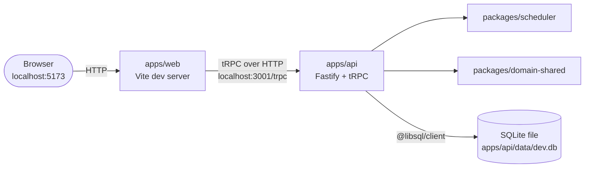
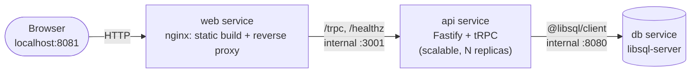

# Architecture

## Services & ports

The direct answer to "what's running on port X":

| Port | Service | When it runs | What it is |
|---|---|---|---|
| 5173 | `apps/web` (Vite dev server) | `pnpm dev:web` | React PWA frontend, hot-reloading |
| 3001 | `apps/api` (Fastify) | `pnpm dev:api`, or internally inside Docker | tRPC API server |
| 8080 | libSQL server | `docker compose up` (`db` service) | Local Turso-compatible database |
| 8081 | nginx (`web` service) | `docker compose up` only | Serves the built frontend, proxies `/trpc` and `/healthz` to `api` |

There's no port 8080/8081 outside Docker: day-to-day development runs `apps/web` and `apps/api`
directly on the host (`pnpm dev:web` / `pnpm dev:api`), talking to a local SQLite file
(`apps/api/data/dev.db`) instead of a libSQL server container. The two diagrams below show both
setups.

## Local development



Run with `pnpm dev:web` + `pnpm dev:api`; see [Getting Started](getting-started.md).

## Docker Compose



`web` is the only service published to the host. `api` has no fixed host port on purpose, so
`docker compose up --scale api=N` can run multiple replicas behind nginx. See
[Docker](docker.md) for the full setup.

## Tech stack

| Layer | Choice | Why |
|---|---|---|
| Frontend | React + TypeScript + Vite, Tailwind CSS, shadcn/ui, Motion | Clean review-session UI without hand-rolling components. |
| Delivery | Installable PWA (service worker, manifest) | Zero-install demo story: a link, not an app-store submission. |
| Database | Turso (managed libSQL) | Single source of truth, server-side. GA, mature Node SDK. |
| Backend API | Node.js + Fastify + tRPC | Thin, typed layer over Turso: review submission, due-card queries, session-cookie auth. |
| Local dev DB | Local `libsql-server` (via Docker) or a plain SQLite file | Full Turso-compatible server when containerized; a flat file for the fast host-side dev loop. |
| Lint/format | Biome | One tool, minimal config, fast. |

## Repo layout

```
KingOfCards/
├── apps/
│   ├── web/                  # React + Vite + TS + Tailwind + shadcn/ui PWA
│   │   ├── src/pages/         # DecksPage, DeckDetailPage, ReviewPage, StatsPage, CommunityPage, auth pages
│   │   ├── src/hooks/         # useReviewSession
│   │   ├── src/lib/           # trpc client, offline queue, auth context
│   │   ├── src/components/    # RequireAuth route guard, shadcn/ui primitives
│   │   └── Dockerfile
│   └── api/                  # Fastify + tRPC
│       ├── src/repositories/  # DB access (decks, cards, due, review log, scheduler state, users, sessions, auth tokens)
│       ├── src/db/            # schema, migrate, seed data
│       ├── src/routers/       # auth router (signup/login/verify/reset)
│       ├── src/router.ts      # tRPC router, the API surface
│       ├── src/trpc.ts        # Context, publicProcedure/protectedProcedure/verifiedProcedure
│       ├── src/levels.ts      # gated level-progression logic
│       └── Dockerfile
├── packages/
│   ├── scheduler/             # SM-2 + HLR-style algorithms, framework-free, its own test suite
│   │   └── src/comparison/    # the simulation harness behind comparison.md
│   └── domain-shared/         # shared Zod schemas/types (Rating, Deck, Card, ...)
├── docs/                      # this site
├── docker-compose.yml
└── mkdocs.yml
```

pnpm workspaces (single `pnpm-workspace.yaml`), Vitest for all three TS packages, Biome for
lint+format.
